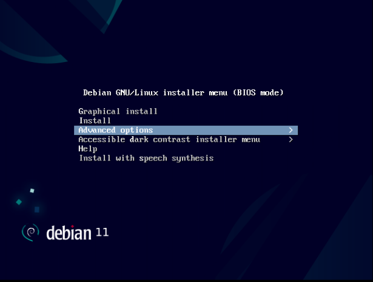
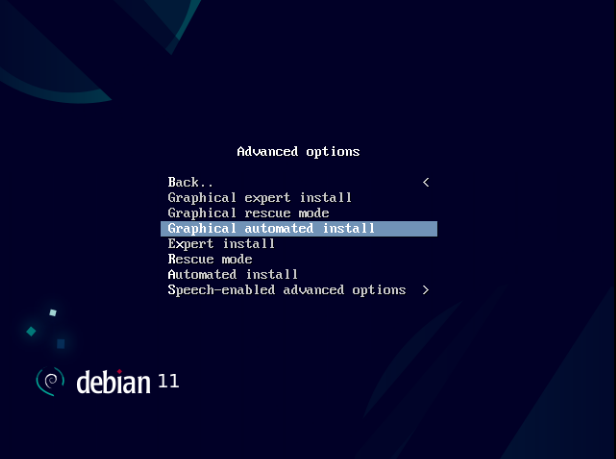

# TP 4 : installation automatisée

Objectifs :

- installer un troisème serveur (presque) sans interaction manuelle ;
- personnaliser un fichier d'installation automatisée ;
- installer et réinstaller plusieurs machines virtuelles légèrement différentes
  (presque) sans interaction manuelle.

## Introduction

Preseed est le système d'automatisation d'installation pour l'installeur
Debian. Il consiste en un fichier de réponse (qu'on appelle fichier preseed),
généralement rendu disponible sur le réseau (via un serveur web par exemple),
dont l'adresse d'accès est donné en argument lors de l'installation.

## Etape 0 : un serveur web en python

Un répertoire `preseed` est disponible à la racine de ce dépôt. Ouvrir un
terminal, puis se déplacer dans ce répertoire. Le langage de programmation
Python dispose d'un module permettant de lancer un serveur web en une commande,
nous allons l'utiliser pour rendre notre fichier preseed accessible.

Lancer la commande `python3 -m http.server 8080`.

## Etape 1 : lecture du fichier preseed

Ensuite, vérifier que le serveur web est bien accessible en essayant d'accéder
à http://127.0.0.1:8080, puis à http://192.168.122.1:8080. Un fichier nommé
`server-13.cfg` doit être visible, et téléchargeable.

## Etape 2 : application du fichier preseed lors de l'installation

Créer une nouvelle machine virtuelle identique à server-11, mais de nom
server-13 (Adapter le nom du fichier de disque en conséquence). Démarrer
l'installeur Debian, puis sélectionner "Advanced Options".

Appuyer sur la touche "Entrée", puis sélectionner "Graphical Automated
Install".

Une fois que l'installeur a réalisé son démarrage, il présente alors un
formulaire pour entrer l'URL du fichier preseed.

Attention ! Le clavier est au format US (qwerty). Entrer l'adresse suivante :
http://192.168.122.1:8080/server-13.cfg puis appuyer sur la touche "Entrée".
L'installation devrait se dérouler sans aucune autre demande de paramètre, et
la machine virtuelle redémarrera toute seule.

## Etape 3 : vérifications

Pour les questions suivantes, lire le contenu du fichier preseed et vérifier
sur la machine virtuelle "server-13" que l'installation concorde.

Question 1 : quel est le mot de passe root ?

Question 2 : est-ce qu'un utilisateur supplémentaire existe ? Si oui, quels
sont ses noms et mots de passe ?

Question 3 : est-ce qu'il y a un décalage entre l'horloge de l'hôte et celle de
la machine virtuelle ? Pourquoi ?

Question 4 : est-ce que les logiciels `htop`, `tree` et `git` sont installés ?

Question 5 : quels sont les paramètres réseau de cette machine virtuelle ?

## Etape 4 : personnalisation et création d'autres fichiers

Eteindre et supprimer les machines virtuelles présentes sur l'hôte.
Puis, modifier et copier le fichier preseed.cfg pour créer 3 machines
virtuelles server-11, server-12, et server-13. Ces 3 machines virtuelles
comporteront les paramètres suivants :

- pour server-11, son IP sera 192.168.122.11 ;
- pour server-12, son IP sera 192.168.122.12 ;
- pour server-13, son IP sera 192.168.122.13 ;
- pour server-12, le paquet "figlet" sera installé.

Pour vérifier que "figlet" fonctionne, il suffira d'entrer la commande `figlet
hello`.
